# pink-events

An investigation that began with a visual curiosity and ended with a
calibrated catalog: 142 supersonic transition-region events in a single
IRIS raster, each with its magnetic ground, its footprint, its energy,
and a measured false discovery rate.

Everything here is reproducible from `import pinkevents`. Every figure
below is a function call.

---

## The observation

While preparing an SPD 2026 presentation, the false-color rendering of an
IRIS Si IV 1394 Å raster showed numerous small, faint, **pink** features
inside the dark interiors of supergranule cells, away from the bright
network where the well-known explosive events live.

The raster is IRIS OBSID **3881013496**, *Very large dense raster
131.7x175 400s Si IV Mg II h/k Deep x 30*:

| | |
| --- | --- |
| date | 2013 October 22, 11:30:30 – 15:04:33 UT |
| pointing | 139″ × 182″ centered near (310″, −95″) |
| sampling | 400 slit positions, ~32 s cadence, 30 s exposures |
| windows | C II 1336, Si IV 1394, Mg II k 2796 |

## What does pink mean?

The rendering mixes colors additively over the spectral axis, so pink is
ambiguous, and the two readings are physically very different. **Violet**
is the blue end of the mapping: a fast upflow near 100–150 km/s.
**Magenta** is red and blue with no green between them: a bidirectional
profile, the classic explosive-event signature.

IRIS measures the spectra, so the distinction is one plot away.

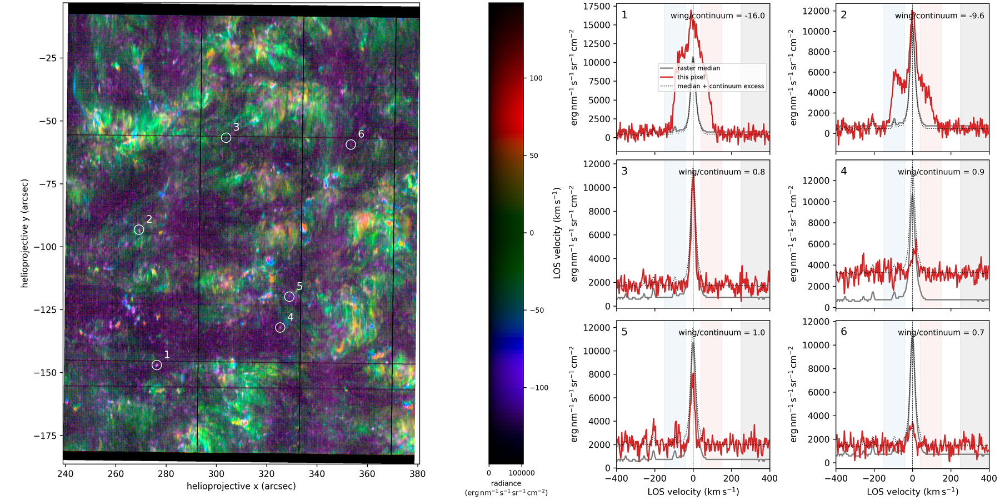

The answer turned out to be *neither, mostly*. The shaded bands are the
line wings and a pure-continuum band; the dotted line carries each
profile's continuum excess across the panel. A profile riding the dotted
line is a **continuum brightening**, not a line event — and most of the
pinkest pixels do exactly that.

The mechanism is a trap worth naming: the rendering normalizes each
wavelength by its own percentile, and the far wings are far fainter than
the line core. A flat continuum excess therefore lifts the wing
wavelengths by a large fraction of their display scale while barely
moving the core. **Flat continuum renders as magenta.** These are the
acoustic-shock grains reported by
[Martínez-Sykora et al. (2015)](https://iopscience.iop.org/article/10.1088/0004-637X/803/1/44),
seen here per pixel rather than statistically.

But a minority are real, and they are the interesting ones.

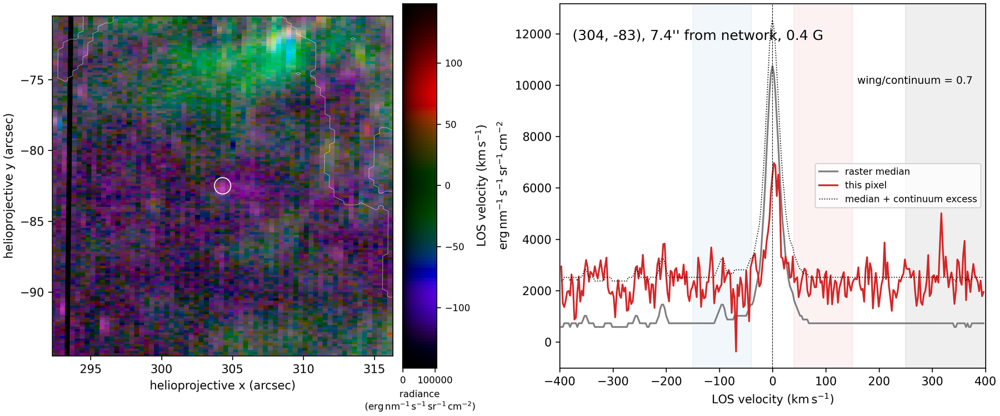

## Finding them all

The wing-versus-continuum test became the detector: score every pixel by
how far its spectrum stands above the raster median in the line wings,
beyond whatever its continuum is doing. Supersonic only — the inner band
edge is the sound speed plus the *measured* width of the line, so nothing
in the band can be explained by the broadening of a stationary profile,
and the Ni II and Fe II blends are excluded outright.

Events are **connected patches**: pixels join at 4σ, and a patch counts
if it holds a 7σ seed. One-sided flows count too, and are classified by
which wing carries the larger excess.

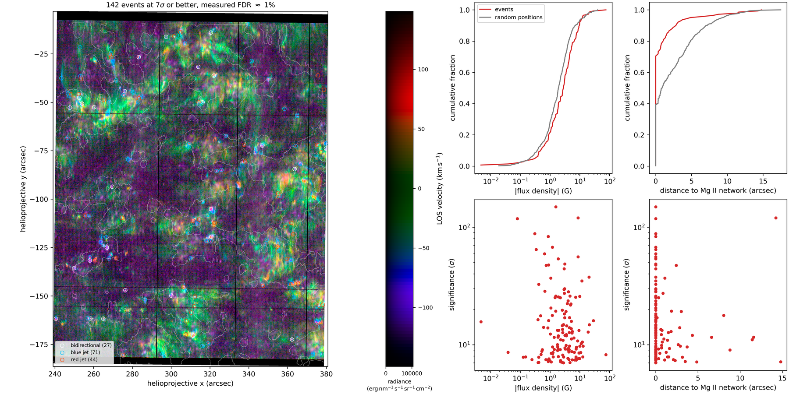

| | events | control |
| --- | --- | --- |
| count | **142** (27 bidirectional, 71 blue jets, 44 red jets) | — |
| measured false discovery rate | **1 / 142** | — |
| touching the Mg II network | 70% | 39% |
| median flux density | 2.6–2.9 G | 1.9 G |
| deep internetwork (>2″, <5 G) | 17 events | — |

Every event carries the HMI line-of-sight flux density beneath it, from
the magnetogram taken the moment the slit crossed it, and its distance to
a chromospheric network mask derived by Otsu's method from the Mg II k
core of the *same raster* — same slit, same times, no coalignment to get
wrong. The control sample is 500 random positions given the identical
measurements, so a preference of the events can be told from a property
of the field.

### Calibration is the point

The number that matters most in that table is the false discovery rate,
because it is **measured, not assumed**, on every build:

- For raw-band scoring, the null is the wing *deficits* — no real event
  produces them, so whatever the detector finds there is what noise and
  systematics alone put over the floor.
- For the positivity-constrained restoration below, deficits are squashed
  by construction, so the null becomes **synthetic**: a raster built from
  the median profile plus each pixel's own measured noise, containing no
  events by construction, pushed through the identical machinery. It
  yields 1 detection where the real raster yields 142.

This discipline earned its keep repeatedly. An early census of 513 events
turned out to be roughly half noise; the deficit control caught it, and
the cause was a median band statistic normalized by the standard error of
a *mean*. A 44σ event turned out to be the pixel two steps downstream of
a data gap, where corrupted-but-finite values sail past a band median.
Neither would have survived to print, because the pipeline is built to
find them.

## Sharpening with the doublet

The Si IV 1394 line is broadened by thermal, non-thermal, and
instrumental widths that no model can cleanly separate — but its
**doublet partner at 1402.77 Å is in the same window**. Same ion, same
temperature, same velocities, same spectrograph, half the opacity, and
no blends within reach. Its median profile is therefore a *measured*
deconvolution kernel, with nothing fitted.

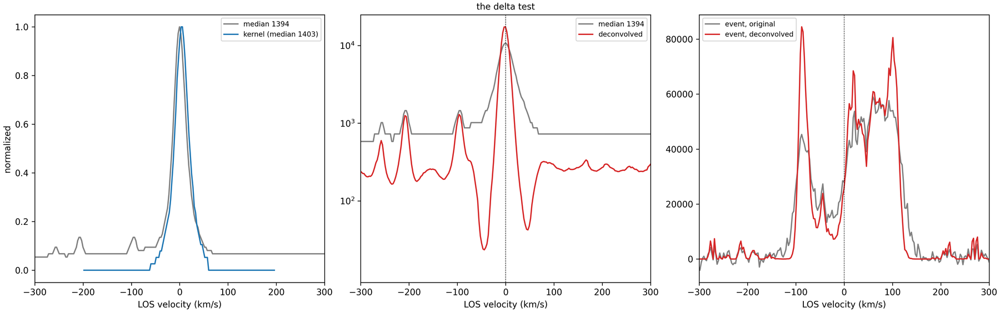

Wiener filtering failed calibration — its ringing scales with the signal,
so excesses and deficits arrive together and no threshold separates
events from the method's own residue. Richardson–Lucy cannot ring: the
restoration is multiplicative and positive. The restored spectra resolve
discrete velocity components the raw ones only smear, and the band edges
are then read off the restored median rather than chosen.

## What they look like

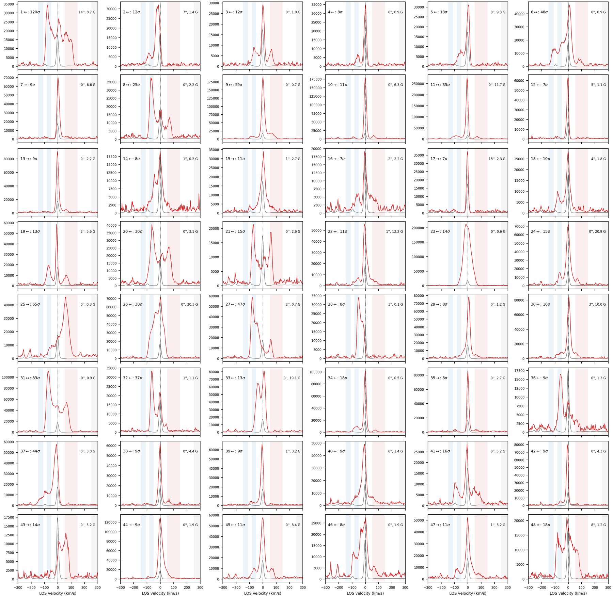

Discrete components, detached jets, symmetric horns, whole-line
displacements. The shaded bands are exactly the samples the detector
integrated, gaps and all — what the eye sees shaded is what the score
summed.

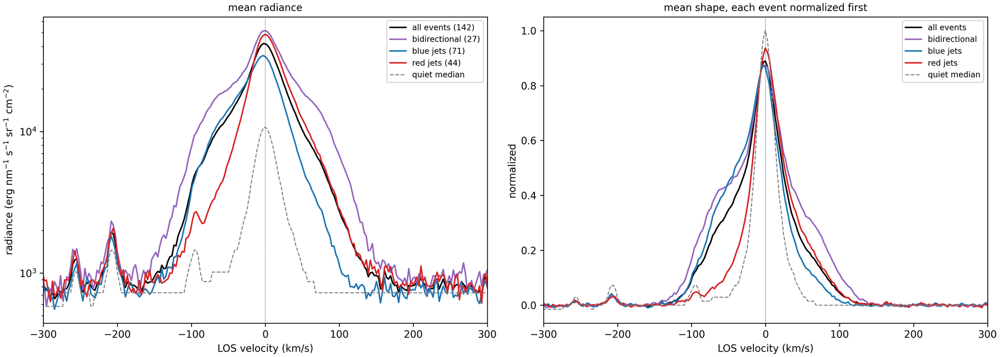

Averaged by class, the labels vindicate themselves on the *full*
profiles, including the parts never scored.

## How deep do they reach?

The same superposed-event machinery, run on every other line the raster
holds, turns the census into a height profile of the atmosphere's
response.

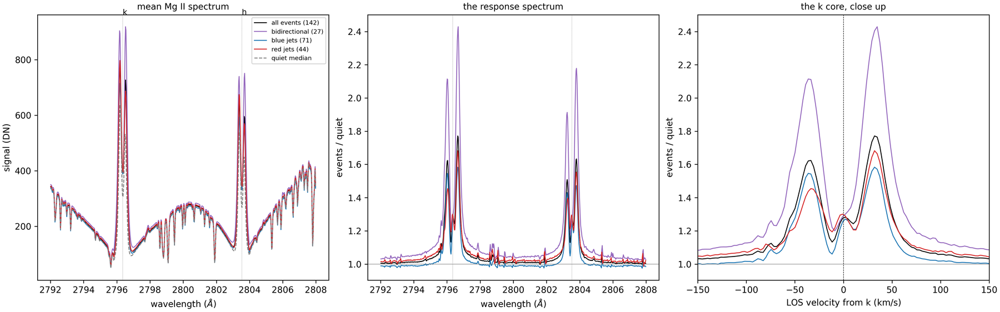
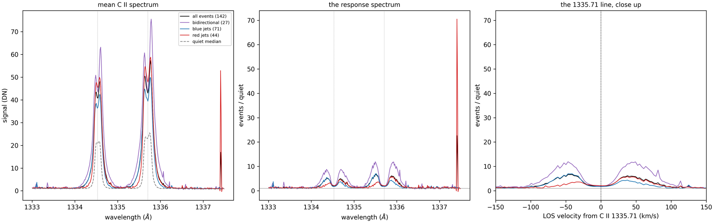

| log T | diagnostic | events / quiet |
| --- | --- | --- |
| ~3.8 | Mg II wings, photospheric blanketing | **1.0 — nothing** |
| ~4.0 | Mg II k2 / h2 peaks | 1.5 – 2.4 |
| ~4.2 | Mg II k3 core | 1.05 – 1.3 |
| ~4.4 | **C II flanks** | **5 – 13** |
| ~4.9 | Si IV | the event itself |
| ~5.15 | O IV] 1401 | ~3 |
| 6.2 | Fe XII 1349 | **nothing** |
| 7.0 | Fe XXI 1354 | **nothing** |

The events are a **spike in the temperature domain**: energy deposited
between roughly log T 4.2 and 5.2, sealed off from the photosphere below
and the corona above. Not flare-like, not coronal, and not buried in the
chromosphere — the cool blends brighten in *emission* under the events,
so nothing cool overlies the hot plasma.

The C II response also **takes sides**: blue-jet events light the blue
flank, red-jet events the red. The flow structure threads continuously
from upper-chromospheric heights into the transition region with its
direction intact.

## How big, how energetic

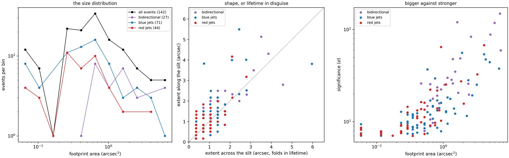

The typical event is **half a square arcsecond** (~550 km across), round
to within the measurement. That roundness is a lifetime measurement in
disguise: the slit sweeps 0.35″ every 32 s, so a long-lived event would
smear across the scan direction. They do not, which bounds typical
lifetimes near the minute-scale crossing time.

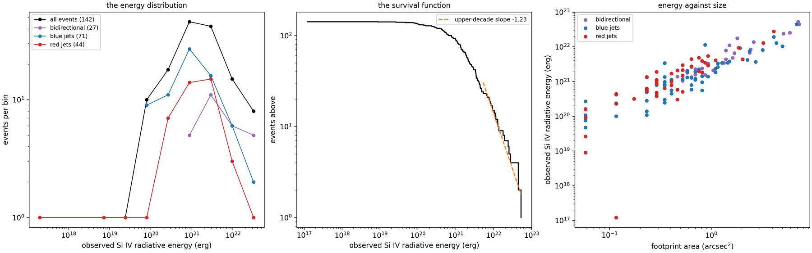

Integrating each footprint's excess radiance over the line, the patch,
and the slit's dwell gives the **observed Si IV radiative energy**: a
median of **1.4 × 10²¹ erg**, spanning 10¹⁷–5 × 10²², totalling
5.7 × 10²³ erg for the census. A lower bound twice over — the event
outlives the slit's visit, and one line is a small fraction of the
transition region's losses.

Fitted by maximum likelihood above the completeness rollover, the energy
distribution has **α = 2.03 ± 0.14**, straddling the critical value of 2
that separates "the big events carry the budget" from "the small ones
do". A power law and a lognormal are statistically indistinguishable here
(|ΔAIC| = 0.2), which is the same ambiguity
[Winebarger et al. (2002)](https://iopscience.iop.org/article/10.1086/324714)
reported for explosive events a decade of energy higher.

Energy rides footprint area on one tight relation that every class
shares — one of three independent arguments (with the size–significance
relation and the response amplitudes) that the classes are **one
population** seen at different strengths and geometries, not three
phenomena.

## What we got wrong

A stacked figure showed the red-jet class filling in the Mg II 2791.6
triplet absorption — heating in the low chromosphere that no other class
showed. It was an artifact.

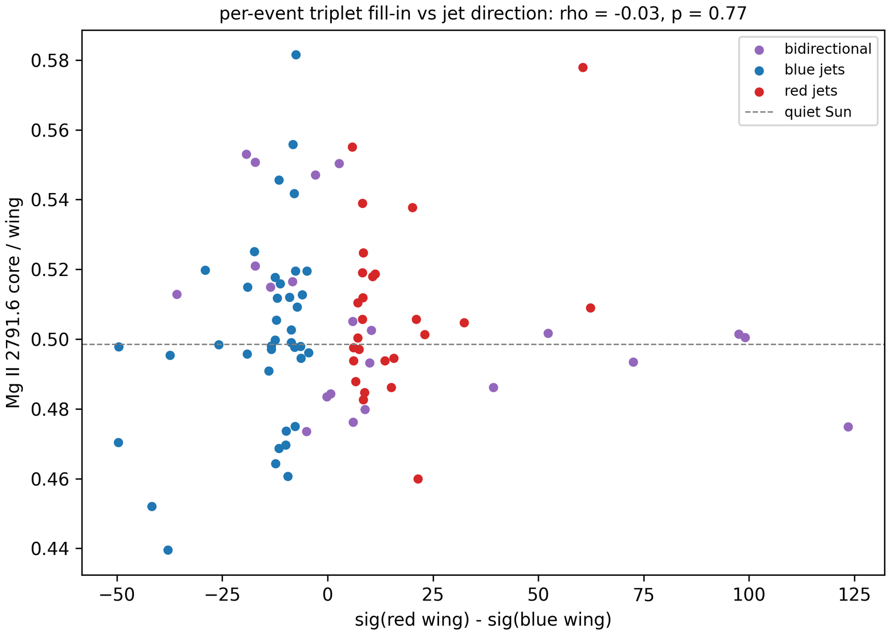

Three tests killed it: no confirmation at the stronger 2798.8 blend, no
per-event correlation with jet asymmetry (ρ = −0.03, p = 0.77), and no
class separation in the per-event ratios. The cause was a narrow
residual: differencing a deep absorption line against a reference with
any sub-pixel registration offset produces a sharp spike at line center.
The same suspicion now attaches to a claimed O I Doppler shift with the
identical morphology.

The lower boundary is sealed for **every** class, which makes the picture
simpler than the version with an exception.

## Open questions

- **Replication.** Every number here comes from one raster. Two more deep
  quiet-Sun rasters are already cached.
- **Completeness.** The energy exponent drifts with threshold, the
  signature of fitting through a rollover. Injection–recovery, reusing
  the synthetic-null machinery, is the prerequisite for any published
  slope.
- **A tension to settle.** A [2024 MNRAS
  study](https://academic.oup.com/mnras/article/529/4/3424/7634249)
  reports quiet-Sun Si IV asymmetry turning *blueward* above 50 km/s;
  our discrete events lean red at 73–150 km/s. Different measurands,
  possibly — or someone's artifact.
- **Timing.** Whether the chromosphere brightens before or after the
  transition-region jet would settle the formation height causally, and
  needs a sit-and-stare series rather than a single-pass raster.

## Using it

```bash
pip install -e .
```

```python
import astropy.units as u
import pinkevents

table = pinkevents.catalog()      # the census, one row per event
pinkevents.statistics()           # the census and its magnetic context
pinkevents.profiles()             # every event's spectrum, in pages
pinkevents.sizes()                # footprints
pinkevents.energies()             # radiative energies
pinkevents.response(1335.708 * u.AA)   # any line the raster holds
```

The raster downloads itself on first use and caches under `~/.iris`;
intermediate results cache under `~/.pinkevents`. The catalog's cache is
keyed on a scoring version, so a change upstream of it can never serve a
stale census.

## Acknowledgements

IRIS is a NASA Small Explorer developed and operated by LMSAL. Built on
[`interface-region-imaging-spectrograph`](https://github.com/sun-data/interface-region-imaging-spectrograph),
[`named-arrays`](https://github.com/sun-data/named-arrays),
[`colorsynth`](https://github.com/sun-data/colorsynth), and
[`solar-dynamics-observatory`](https://github.com/sun-data/solar-dynamics-observatory).
